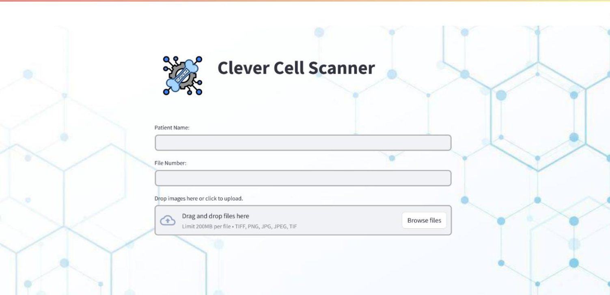
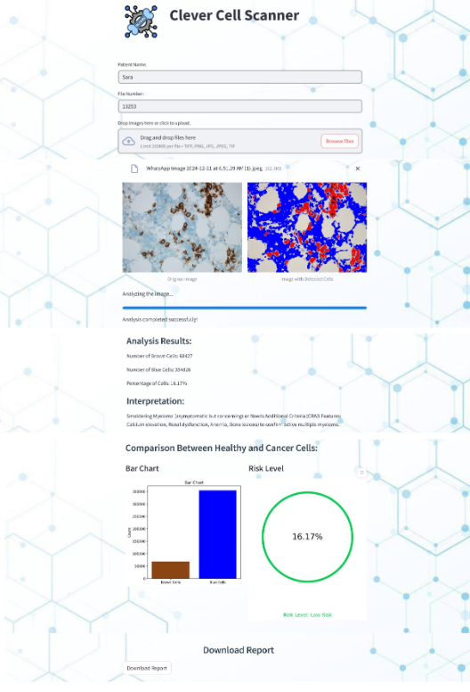

## Clever Cell Scanner Project

## Description

In this project, a comprehensive methodology is presented to develop a deep learning model that aims to improve the accuracy and efficiency of detecting CD138-positive plasma cells in the diagnosis of multiple myeloma (MM). Advanced image processing and deep learning techniques were used to overcome the limitations associated with traditional manual methods, which are prone to human errors and variability in assessments.
A diverse and comprehensive dataset was collected, with new images added from a healthcare center in Saudi Arabia to enhance data diversity. Advanced preprocessing steps, including color space transformation, filter application, and mask generation, were applied to ensure the quality of the input data for the model. A U-Net model was built with minor modifications to achieve accurate image segmentation into four classes: background, brown cells, blue cells, and purple cells.
The model demonstrated strong performance in the assessment, achieving a high accuracy of 93.86% on the validation set, with a low loss of 0.1445. The confusion matrix and ROC curve also showed excellent results, with high AUC values ​​for different classes (0.94 for background, 0.97 for brown cells, and 0.94 for blue cells). In addition, the model showed a good balance between precision and recall for all classes, reflecting its ability to accurately classify without biasing one class over another.
The model was tested on new images to ensure its generalizability, and a simple user interface was developed to facilitate interaction with the system. These results enhance the potential of the model for clinical applications, where it can serve as a powerful aid in diagnosing multiple myeloma and improving the accuracy of medical assessments.
In the future, the model can be further improved by increasing the size of training data, improving image preprocessing, and exploring deep learning techniques to improve the performance of classes with lower recall. Overall, this model is an important step towards automating and improving the accuracy of medical diagnosis, which contributes to improving the quality of healthcare.

## Requirements

To run this project, follow these steps:

- **Go to Google Colab site "https://colab.research.google.com/"**  
- **Upload `Streamlit_colab.ipynb` to Colab and open it.**  
- **Upload to the content of Colab the following:**
    1. `Font_static.zip` file and unzip it
    2. `main.py`
    3. `plasma_model.h5`
    4. `req.txt`
- Run the cells, and when the general link is generated in the last cell, select it to open the interface.
- This is the interface that will appear to you:

## Languages and Tools used:
- **Python**
- **TensorFlow**
- **Keras** 
- **OpenCV**
- **Ngrok** 

## Model used:
- **U-Net Model for segmentation and classification**

## Training with new data

1. Download or clone this repository.
2. Unzip the dataset files and merge them into one folder called *data*.
3. Upload the folder `data` to your Google Drive.
4. Open `Training_CD138_2_(3).ipynb` using Colab. Don't forget to adjust the data path to suit your path.
5. Run the code.
6. If you want to use the interface for your new model, replace the `plasma_model.h5` model with the new model file.
